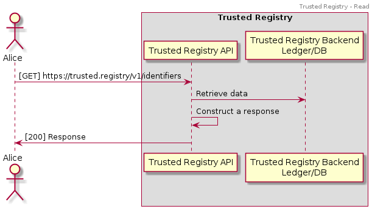
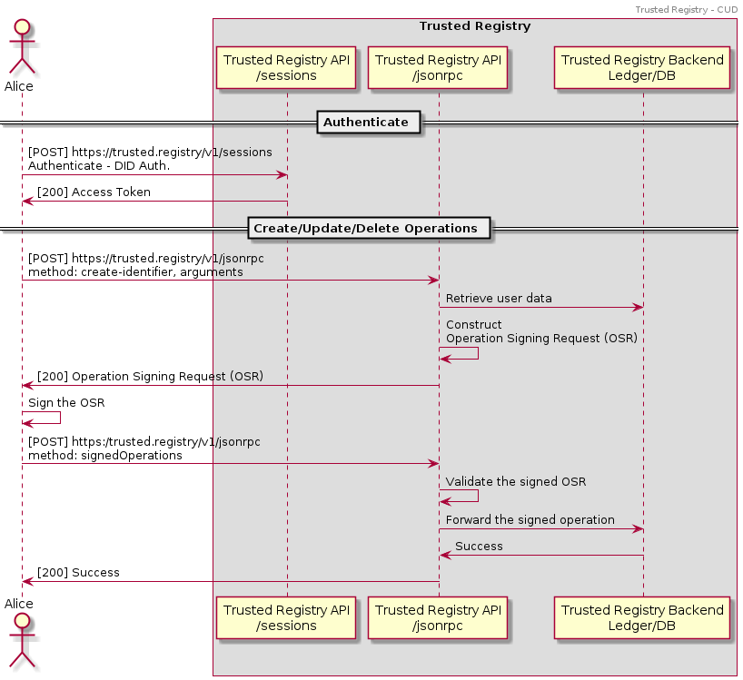

# Universal Services

DID Methods and Trusted Registries are mostly implemented on ledgers to
provide a high level of trust and transparency. In most cases, registries
expose REST APIs for obtaining information, whereas Create/Update/Delete (CUD)
operations are tightly related to the implementation/underlying technology.

The Universal Services architecture aims to abstract away the underlying
technology and enables to interact with a wide range of registries in a
universal/generic way.

## A high-level overview

When Alice wants to get a list of all registered identifiers from a Trusted
Registry, e.g., a DID Registry, she calls the REST APIs, e.g.
```GET https://trusted.registry/v1/identifiers```, as presented in the diagram below:



[Universal Resolver](https://github.com/decentralized-identity/universal-resolver/) can
be used to standardize and unify the read operations.

However, when Alice wants to write to the registry (or update/delete
entries), the interaction is usually tight to the underlying
technology/implementation. Hence, we introduce helper APIs and Operation Signing Request (OSR):
* insert/update/delete JSON-RPC helper methods that construct an Operation-Signing Request (OSR),
* signedOperations JSON-RPC method that processes the signed OSRs.

Whenever a registry supports the above-mentioned methods, interaction with the registries can become universal/independent of the underlying technology:

1. (optional) Alice authenticates to the registry, e.g., she performs a DID Auth.
2. Alice calls the create/update/delete helper JSON-RPC method with the
input arguments.
3. The JSON-RPC API checks the input method, validates the input arguments,
and creates an Operation-Signing Request (OSR).
4. Alice receives the OSR and signs it.
5. Alice sends the signed OSR to the Trusted Registry API (signedOperations method).
6. The API validates the request and performs the operation.



The only technology dependency that remains is the required/supported signature
type.

## Technical specifications

In this section, we present the Operation-Signing Request data model and properties of the universal APIs (uAPIs).

### Operation-Signing Request

OSR is a Verifiable Credential that holds the following information

* Trusted Registry information (DID)
* Operation information
* Signing payload

A non-normative example:

```
{
    "@context": [
        "https://www.w3.org/2018/credentials/v1",
        "https://www.w3.org/2020/osr/v1"
    ],
    "id": "did:trusted-registry:123abc/osr/1872",
    "type": [
        "VerifiableCredential",
        "OperationSigningRequest"
    ],
    "issuer": "did:trusted-registry:123abc",
    "issuanceDate": "2020-12-12T12:11:44Z",
    "expirationDate": "2020-12-12T12:16:44Z",
    "credentialSubject": {
        "id": "did:alice:a11ce",
        "method": "insertIdentifier",
        "inputArguments": {
          "didDocument": "{base64url encoded DID Document}"
        },
        "rawSigningPayload": [01 a2 ...],
        "signingAlgValuesSupported": [ES256, EdDSA],
    },
    "proof": {
        "type": "RsaSignature2018",
        "created": "2020-12-12T12:11:49Z",
        "proofPurpose": "assertionMethod",
        "verificationMethod": "did:trusted-registry:123abc",
        "jws": "eyJhbGciOiJQUzI1NiIsImI2NCI6ZmFsc2UsImNyaXQiOlsiYjY0Il19
          ..DJBMvvFAIC00nSGB6Tn0XKbbF9XrsaJZREWvR2aONYTQQxnyXirtXnlewJMB
          Bn2h9hfcGZrvnC1b6PgWmukzFJ1IiH1dWgnDIS81BH-IxXnPkbuYDeySorc4
          QU9MJxdVkY5EL4HYbcIfwKj6X4LBQ2_ZHZIu1jdqLcRZqHcsDF5KKylKc1TH
          n5VRWy5WhYg_gBnyWny8E6Qkrze53MR7OuAmmNJ1m1nN8SxDrG6a08L78J0-
          Fbas5OjAQz3c17GY8mVuDPOBIOVjMEghBlgl3nOi1ysxbRGhHLEK4s0KKbeR
          ogZdgt1DkQxDFxxn41QWDw_mmMCjs9qxg0zcZzqEJw"
    }
}
```

### Universal APIs

In this section, we provide OpenAPI specifications for the core CRUD universal operations.

See: [OpenAPI Specs](api/openapi.yaml)

## Immutable APIs

The immutable-API design description goes here.

## TODO

* OSC schema
* Immutable APIs design description

## References

* https://w3c.github.io/did-core/
* https://www.w3.org/TR/vc-data-model
* https://github.com/decentralized-identity/universal-resolver
* https://github.com/decentralized-identity/universal-registrar
* https://api.ebsi.xyz/docs/